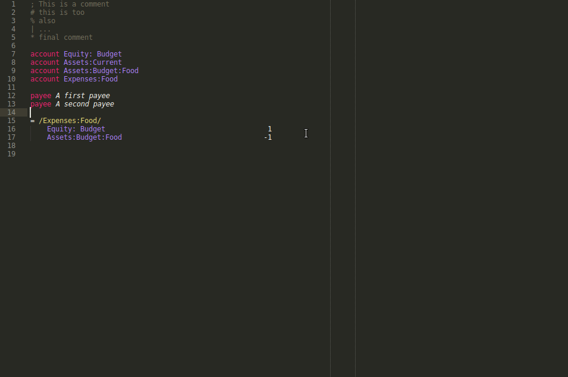

# LedgerTools - A SublimeText pluggin for Ledger CLI

LedgerTools is a [Ledger CLI](ledger-cli.org) pluggin for Sublime Text.



Features:

- Syntax definition
- Auto-align the amounts
- Makes payee and account insertion easier
- Auto-detection of non-cleared entries
- Automatic transaction notification

## Installation

The easiest way is to use the PackageControl. Search for the `LedgerTools` package and install it.

Other solution: just clone it to the Package directory.

```
git clone https://github.com/etienne-monier/LedgerTools.git ~/.config/sublime_text/Packages/LedgerTools
```

## Some words about how I maintain my journal

I dislike mixing all user transactions with all the payee, account, automatic transaction definitions. What I usually do is to define a main file `main.ledger` whose content is

```
; This is main.ledger

include definitions.ledger
include current.ledger
```

In the same directory, I then have two other files `definition.ledger` and `current.ledger`. The first one keeps all commands and automatic transactions.

```
; This is definition.ledger

account First account
account Second account

payee A payee

tag aTag

= /aReGeX/
    First account     10 EUR
    Second account   -10 EUR
```

The second one keeps all user transactions.

```
; This is current.ledger

04/02/2021 A payee
    First account     10 EUR
    Second account   -10 EUR
```

**This distinction is important as the program looks for account, payee and automatic transaction definitions in `definition.ledger` to work. This file location should be given in the package settings**. 

Note: This does not mean you can not mix the two files in a single one, but it means you have to define this single file as the definition file in the settings.   


## Auto-align the amount

The package provides a sublime command `ledger_align_amounts`to align all dots in amounts at a position specified in the settings via the `dot_pos` key. This default position is 58. 

The associated shortcut is `Ctrl+Shift+q`.

The amounts can also be automatically aligned as long as:
- the `automatic_amount_alignment` setting is set to `true` (which is the default),
- the current file extension is specified in the `valid_ledger_file_ext` setting.

## Easy payee and account insertion

### How it works?

If, like me, you define payees and accounts to keep a consistent journal, you may have a file with lots of definitions like this:

```
account Expenses:Books
payee My Favorite Book Shop

account Expenses:Food
payee The Amazing French Restaurant
```

Then, you only have to specify the filename as the `definition_filename` setting. Then, two default keymaps are defined: `Ctrl+Shift+a` to insert an account at the cursor position and `Ctrl+Shift+z` to insert a payee. A quick panel oppens and you can search whatever you want by typing some words.

### What about virtual account?

If, like me, you also use Ledger to budget (e.g. [You Need A Budget](https://www.youneedabudget.com/)), then you may have virtual accounts associated to budget.

```
account Budget:Books
account Budget:Food
```

Then don't worry, the Budget accounts are also proposed when inserting the account and once inserted, the brackets will be auto-inserted to give that.

```
2020/07/24 * My Favorite Book Shop
    Expenses:Books                      10 EUR
    Assets:Checking                    -10 EUR
    [Equity:Budget]                     10 EUR
    [Budget:Books]                     -10 EUR
```

## Auto-detection of non-cleared entries

The pluggin assumes you use the cleared entries system.

To explain this, consider a list of entries such as 

```
2020/07/24 * My Favorite Book Shop
    Expenses:Books                      10 EUR
    Assets:Checking

2020/07/25 * Mr Jones
    Expenses:Books                       5 EUR
    Assets:Cheking

2020/07/25 Forno Gusto
    Expenses:Food                        9.50 EUR
    Assets:Cheking
```

In this list, the first two entries are denoted cleared with a star placed before the payee. The last one (Forno Gusto) is not cleared. This can mean whatever you want. In my case, I use it to denote the transactions that do not appear yet on my online bank register so that, when I type

```
ledger balance Assets --real --cleared
```

(notice the `--cleared` option), the Forno Gusto transaction is not taken into account and I get the same balance as my bank. That helps me to be sure not to make a mistake. When the transaction appear in my bank balance, I simply add a star. **Meanwhile, the pluggin highlights the entry which has not been cleared.** This helps to see imediatly which entries are still pending.

**Notes:** 

1. By default, Ledger consider all entries, even those which are not cleared. As a consequence, 

```
ledger balance Assets --real
```

would take the Forno Gusto transaction into account.

2. If you don't whant this feature, please modify the `Ledger.sublime-syntax file` following lines (70-72):

```
        # Non-cleared entry
        - match: '\s+({{payee}})'
          captures:
            1: invalid
```

to 

```
        # Non-cleared entry
        - match: '\s+({{payee}})'
          captures:
            1: markup.italic.desc
```

## Automatic transaction notification

Again, I usually use automatic transaction to maintain my Budget. For that, I define a lots of them in my definition file, like

```
= /Depenses:Food/
    [Equity:Budgets]                                   1
    [Assets:Budgets:Food]                             -1
```

The user transactions defined in the `current.ledger` file hiding an automatic transaction is notified with the hidden transaction detail. 

## Author and license

This pluggin has been written by [Etienne Monier](https://etienne-monier.github.io/).

It is distributed under the Creative Commons BY-NC-SA 4.0 license.


You are free to:

- **Share** — copy and redistribute the material in any medium or format
- **Adapt** — remix, transform, and build upon the material

Under the following terms:

- **Attribution** — You must give appropriate credit, provide a link to the license, and indicate if changes were made. You may do so in any reasonable manner, but not in any way that suggests the licensor endorses you or your use.

- **NonCommercial** — You may not use the material for commercial purposes.

- **ShareAlike** — If you remix, transform, or build upon the material, you must distribute your contributions under the same license as the original.  